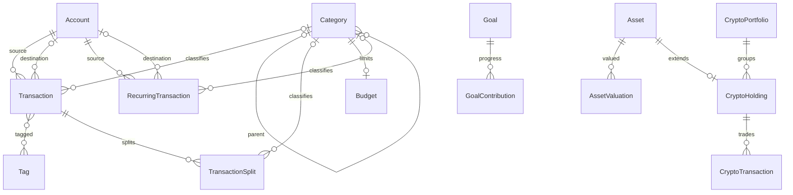

# Multi-Currency v1: аудит и принятый дизайн

Статус: **реализовано локально по разрешению пользователя**. Результат и проверки: [multicurrency-v1-validation.md](multicurrency-v1-validation.md). Ниже сохранён исходный аудит и принятый дизайн от 2026-09-24, базовый HEAD `64a1906`, Aurum `1.1.8`. Примеры синтетические.

## 1. Git и границы проверки

- Рабочая ветка: `feat/multicurrency`, tracking `origin/feat/multicurrency`. Ветка `feat/multi-currency` отсутствует.
- До создания этого документа рабочее дерево чистое.
- `origin`: `https://github.com/lichmanuyk/Aurum.git`; `upstream`: `https://github.com/Zproger/Aurum.git`.
- `main`, `personal`, feature, локальные `upstream/main`, `origin/main`, `origin/personal`, `origin/feat/multicurrency` указывают на `64a1906`.
- Reflog: checkout `main → personal → feat/multicurrency`; feature создана из HEAD. Следовательно, происхождение от personal подтверждено, reset/rebase не нужны.
- `main` отслеживает `upstream/main`, `personal` — `origin/personal`. Это не ошибка; при публикации main нужно явно выбирать origin. Tracking main можно отдельно перевести на origin/main, это не требует изменения истории.
- Последние коммиты: `64a1906` обновляет Python dependencies, `0cf7283` — frontend dependencies, `848ff21` добавляет банковские CSV-профили и версию 1.1.8.
- Отдельная ветка/worktree `worktree-monefy-import` содержит `e335624` с конвертером; этот коммит не входит в текущую feature. Конвертер не является основой нового FX layer.
- Fetch не выполнялся: равенство remote-tracking refs не доказывает отсутствие новых коммитов на GitHub.
- Docker backend/db/web работают и healthy. Volume не удалялся, миграция пользовательской БД не запускалась.

```text
64a1906  main = personal = feat/multicurrency
    └── e335624  worktree-monefy-import
```

## 2. Подтверждённая domain model



AppSettings и CryptoSyncState — singleton-таблицы. Связей Account ↔ Asset/Crypto и GoalContribution ↔ Transaction нет.

Уточнения исходного описания:

1. Transaction.amount положителен, знак определяется типом. Transfer — одна запись, обе стороны используют одну сумму.
2. Splits: минимум две строки, сумма точно равна Transaction.amount, category_id родителя операции NULL. **Все категории split должны принадлежать одному top-level parent**; произвольные независимые категории сейчас запрещены маршрутом `_build_splits`.
3. Account.is_archived уже существует. Архивация скрывает счёт из обычного списка, но не исключает его историю из агрегатов.
4. Net Worth включает checking/debit_card/savings/cash/investment; **credit_card и other исключены**. Это ограничение модели капитала, не FX-функция.
5. AssetValuation не имеет валюты, логически наследует Asset.currency; уникальна по `(asset_id, as_of_date)`. Monthly cash flow — оценка пользователя, не поток реальных операций.
6. Crypto использует weighted-average cost; продажи уменьшают количество без изменения средней цены остатка. Реализованного tax-lot ledger нет.
7. GoalContribution допускает отрицательные суммы, не двигает деньги и не добавляется в Net Worth.
8. Budget — один действующий лимит на категорию, без истории лимитов; parent-budget включает children, отдельный child-budget отслеживается параллельно.
9. Recurring действительно проводится вручную, но запись Transaction создаётся напрямую, обходя transfer/split validators обычного write-path.

## 3. Полная карта влияния

Пути в таблице относительно репозитория. Для каждой строки нужны изменения соответствующих schemas/types и контрактные тесты.

| Область | Фактические точки | Что требуется |
|---|---|---|
| Модели | `backend/app/models/{account,transaction,asset,goal,budget,crypto,recurring,settings}.py` | FXRate; destination_amount; фиксированные валюты Goal/Budget/threshold; crypto quote currency |
| Schemas | `backend/app/schemas/{account,transaction,asset,goal,budget,crypto,recurring,settings,backup}.py` | Валидаторы валют/precision, effective PATCH state, новые поля write/read |
| Агрегатные schemas | `schemas/{dashboard,reports,cash_flow,net_worth,insights,advice}.py` | reporting_currency и явный статус полноты/ошибки FX |
| Accounts | `services/account_service.py`, `api/routes/accounts.py` | Общий расчёт native legs, destination_amount, as-of balance, запрет переименования валюты истории |
| Transactions | `api/routes/transactions.py` | CREATE/PATCH/bulk; загрузка destination account, проверка валют и обоих amount, сортировка сумм |
| Cash Flow | `services/cash_flow_service.py` | Сейчас SQL SUM по месяцу без валют/даты FX; сначала конвертация операций, потом группировка |
| Dashboard | `services/dashboard_service.py` | Income/expense и transferred_out в reporting currency, переводы не входят в net |
| Reports | `services/reports_service.py`, `category_rollup.py` | Сохранять дату/валюту/transaction id до конвертации, единый split-aware слой |
| Budgets | `services/budget_service.py`, `api/routes/budgets.py` | Лимит в фиксированной валюте бюджета; actual по историческим курсам в ту же валюту |
| Net Worth | `services/net_worth_service.py` | Native остатки по каждому счёту и активу, FX на каждый день оценки, затем сумма; breakdown/risk/roles из того же snapshot |
| Assets | `api/routes/assets.py` | Native valuation/monthly_cash_flow; запрет смены валюты истории; исключение будущих оценок из current |
| Crypto | `services/crypto_service.py`, `api/routes/crypto.py` | Создание holding, журнал buy/sell, WAC, sync/cache, history, performance и portfolio aggregation |
| Goals | `services/goal_service.py`, `api/routes/goals.py` | Goal.currency, native contributions/progress, запрет смены валюты после contributions |
| Recurring | `services/recurring_service.py`, `api/routes/recurring.py` | Currency в read; destination amount при posting; единый validator операций |
| Insights | `services/insights_service.py` | Устранить копию расчёта balances; idle threshold в своей валюте; incomplete FX не означает отсутствие риска |
| Advice | `services/advice_service.py` | Собственные raw SUM заменить общими FX/split-aware contributions; currency у денежных params |
| Settings | `api/routes/settings.py`, `services/settings_service.py`, `db/seed.py` | Reporting currency только меняет проекцию; не переименовывает стоимость имущества/лимиты |
| Backup | `schemas/backup.py`, `services/backup_service.py`, `api/routes/backup.py` | Версия 2, version adapter, FX и overrides, строгая preflight validation, атомарный restore |
| CSV | `frontend/src/pages/CsvImportPage.tsx`, `lib/{csv,bankPresets}.ts`, `/transactions/bulk` | Валюта выбранного счёта, проверка currency column, decimal parsing, destination amount при поддержке transfers |
| Frontend contract | `frontend/src/types/index.ts`, `api/*.ts`, `api/client.ts` | Decimal string сохраняется, native/reporting не смешиваются, структурированные FX errors |
| Форматирование | `frontend/src/lib/{format,currency,i18n}.ts` | Обязательная явная валюта в денежных компонентах, отдельные precise/compact форматы |
| Native UI | `components/accounts/{AccountFormModal,AccountList}.tsx`, `transactions/{TransactionFormModal,TransactionsTable}.tsx`, `dashboard/RecentTransactionsCard.tsx` | Currency picker; native balance/amount; две стороны перевода; cents |
| Asset/Goal UI | `components/networth/{AssetFormModal,AssetsTable}.tsx`, `components/goals/*` | Валюты форм, native оценки и цели |
| Recurring/CSV UI | `components/recurring/*`, `pages/CsvImportPage.tsx` | Подписи native валют; ввод фактически полученной суммы при Post now |
| Aggregate UI | Dashboard/CashFlow/Reports/Budget/NetWorth/Advice pages и charts | Валюта берётся из response; missing FX не показывается как 0 |
| Crypto UI | `components/crypto/*`, `pages/CryptoPage.tsx` | Общая reporting валюта для allocation/stats; quote currency цен и журнала; не складывать native holdings |
| ROI | `pages/RoiPage.tsx`, `components/roi/*` | Автономный калькулятор: оба входа в одной явно указанной валюте; FX engine не нужен |
| Query cache | `hooks/use{Settings,Transactions,Accounts,Assets,Crypto,Recurring}.ts` и aggregate hooks | Инвалидация после FX/settings/restore; reporting currency входит в ключи; native balances тоже обновляются |
| Tests/CI | `backend/tests/*`, frontend Vitest, `e2e/tests/*`, `.github/workflows/ci.yml` | Числовые инварианты + PostgreSQL migrations + UI; текущий CI не запускает e2e |

### Найденные дополнительные дефекты/риски

- AccountFormModal и AssetFormModal не передают currency: новые сущности через UI получают schema default USD независимо от выбранной display currency.
- AccountList, TransactionsTable, RecentTransactionsCard, AssetsTable, GoalList, RecurringList и CSV preview вызывают formatCurrency без native currency.
- formatCurrency принудительно показывает 0 дробных знаков. Исправить символ недостаточно: `431.27` должно оставаться видимым в деталях.
- Backend разрешает PATCH currency Account/Asset без преобразования истории. После FX это должно быть запрещено при зависимых данных, включая incoming transfers и recurring templates.
- Crypto refresh берёт AppSettings.currency, но Asset.currency установлен при создании holding. После смены settings новые valuations и last_price могут иметь другую единицу, чем старые valuations/cost basis. Истинную валюту старых записей восстановить только по данным модели невозможно.
- Net Worth сначала складывает native деньги. Current breakdown использует последние события даже будущих дат, тогда как daily series ограничена today: нужна единая as-of семантика.
- Advice category sums не учитывают splits; не копировать этот дефект в FX layer.
- Backup v1 не содержит CryptoHolding.network; CryptoSyncState также не экспортируется/не сбрасывается. Network надо сохранить, cache sync state можно сознательно сбрасывать при restore.
- В account-filter Transaction list сейчас учитывается только source; входящий transfer не виден. Для account ledger нужен source OR destination и сумма соответствующей стороны.
- Transaction amount sorting сравнивает native числа разных валют; в v1 сохранить legacy режим с явной подписью, добавить отдельный reporting sort до pagination, либо отключить глобальную сортировку сумм в UI при mixed currencies.
- Денежные числа в Advice params переводятся в float; новый контракт должен возвращать денежные строки с currency.

## 4. Предлагаемый design v1

### 4.1. Валюты и инварианты

- Сохранить `AppSettings.currency` как reporting/default display currency. Не добавлять второй почти одинаковый глобальный currency field.
- Account.currency и Asset.currency — единицы хранения. Transaction, splits и recurring наследуют currency Account; AssetValuation и monthly_cash_flow — Asset.
- Добавить `Goal.currency`, `Budget.currency`, `AppSettings.idle_cash_threshold_currency`. Default для новых объектов — текущая reporting currency, затем значения независимы от её переключения.
- GoalContribution наследует Goal.currency. Goal не является отдельным финансовым активом.
- После появления зависимых денег currency сущности неизменяема обычным PATCH. Исправление неправильно размеченного legacy account — отдельная явная миграция, не скрытая конвертация.
- Для нового API currency проверяется централизованно по поддерживаемому каталогу, upper-case. Старые неизвестные коды не заменять на USD: preflight report.
- Archived accounts остаются в финансовой истории и капитале. Архивация не обнуляет остаток. Для закрытия с остатком нужен явный transfer/adjustment.
- Предлагаю запретить удаление Accounts с денежной историей и использовать archive: текущие CASCADE/SET NULL несовместимы с надёжным наследованием валют и сохранением transfer chain.

### 4.2. FXRate

Отдельная таблица `fx_rates`:

| Поле | Тип / смысл |
|---|---|
| id | PK |
| base_currency | String(3), исходная валюта |
| quote_currency | String(3), целевая валюта |
| rate_date | Date, дата действия |
| rate | Numeric(38,18), единиц quote за одну base |
| source | String(50), manual/provider/import-reference |
| created_at, updated_at | timestamps |

Constraints: rate > 0, base != quote, unique(base_currency, quote_currency, rate_date); пары нормализованы в одном направлении (например, лексикографическом), обратный курс вычисляется. Это одна выбранная reference rate на день, не хранилище всех банковских котировок. Source не входит в unique: несколько провайдеров не должны давать недетерминированный результат.

Conversion service получает `(amount, source_currency, target_currency, date, policy)` и возвращает Decimal плюс использованные даты/пары/source. Правила:

1. Одинаковая валюта: identity, без запроса курсов.
2. Для точной даты: direct/inverse; затем один фиксированный pivot USD, если обе ноги существуют на эту же дату. Не искать произвольный граф путей.
3. Если точной даты нет: последний предыдущий доступный день в пределах 7 календарных дней. Для pivot обе ноги должны относиться к одному дню. Это явный as-of policy с фактической rate_date в результате.
4. Будущие курсы никогда не используются; более старый курс считается missing/stale. Исторические дни вне окна требуют загрузки истории или явного ручного курса.
5. Direct имеет приоритет над pivot на одной дате; алгоритм и policy версионируются в документации. Pivot фиксирован независимо от reporting currency.
6. Загрузка ставок пакетная на диапазон дат/набор валют, без запроса на каждую операцию. Не вызывать внешние API при построении отчётов.

v1 включает ручной ввод и пакетную загрузку reference rates через API/UI. Автоматический провайдер — отдельный adapter после проверки покрытия BYN/IDR и всей истории; конкретный источник пока не выбран. Это prerequisite удобной эксплуатации, но не причина привязывать core к поставщику.

Reference rate можно явно исправить: зависимые вычисляемые отчёты пересчитываются и UI-кэш инвалидируется. Это не immutable accounting ledger; хранить frozen amount для каждой обычной операции в v1 не предлагаю.

### 4.3. Effective rate и импортированная reporting amount

Bank spread не должен менять общий дневной FXRate. Для Monefy и ручных исключений предлагаю optional пару полей Transaction:

- `reporting_amount_override` (Decimal, положительная сумма);
- `reporting_currency_override` (String(3));
- `reporting_override_source` (например, manual/monefy).

Все обязательны вместе; для income/expense. Native amount остаётся source of truth движения денег; override — source of truth оценки этой конкретной операции в указанной валюте. Effective rate вычисляется из отношения, отдельно не дублируется.

При совпадении target с override currency используем точную сохранённую сумму. Для другого target: override amount → target по reference rate на дату операции. Таким образом, переход display PLN→EUR не теряет импортированную PLN-оценку. Такое поведение должно быть явно указано пользователю; override можно явно удалить.

PATCH native amount/date/account требует повторного указания override или явного удаления; изменение только description не затрагивает его. Split-строки делят reporting сумму пропорционально native суммам с детерминированным распределением остаточных минимальных единиц.

Это не обязательная reporting_amount для каждой записи и не ставка для переоценки account balance. Разные effective rates в один день не конфликтуют.

### 4.4. Transfers

Сохраняем одну Transaction. `amount` — source amount; добавляем `destination_amount` Numeric(14,2).

```text
source EUR:       amount = 100.00
destination PLN:  destination_amount = 431.27
account delta:    -100.00 EUR / +431.27 PLN
effective rate:   4.3127 PLN/EUR (вычисляется)
```

- Для cross-currency destination_amount обязателен; для same-currency по умолчанию равен amount и должен ему равняться.
- Для новых non-transfer destination_amount должен быть NULL. Для новых transfers обязателен destination account, отличный от source.
- Fee — отдельная expense в валюте списания. Например, transfer 100 EUR + fee 1 EUR означает списание 101 EUR; UI может атомарно создать обе записи. Скрытый spread уже отражён в двух суммах, не создавать вторую expense из разницы market/effective FX.
- Ручной курс — вспомогательный input, по которому UI предлагает destination amount. Сохраняем фактическую принятую сумму; не три независимых значения amount/rate/destination.
- Transfers исключены из income/expense/Cash Flow. Dashboard transferred_out — информационный объём source legs по reference FX на дату, без влияния на net.
- PATCH даты сохраняет фактические суммы; PATCH счетов/amount проверяет effective итоговую запись и требует явную новую destination_amount при изменении валютной пары. Запись атомарна.
- Recurring: same-currency сохраняет текущий one-click UX; cross-currency Post now запрашивает фактически полученную destination_amount. В template не хранить вечный банковский курс; schema posting получает optional destination_amount и проверяет необходимость.
- Все write-paths — single, PATCH, bulk, recurring, restore — используют общий слой денежных invariants. Валидаторы нельзя оставить только в Pydantic create.

### 4.5. Flow и stock считаются по-разному

**Dashboard, Cash Flow, Reports:** каждая income/expense конвертируется на Transaction.date (с override при наличии), затем складывается. Category/split aggregation получает уже одинаковую валюту. Нельзя сначала суммировать месячные native суммы, а затем применять один курс.

**Account balance:** native legs до выбранной даты; FX для native balances не требуется. Future-dated transactions исключены из current; в историческом ledger остаются доступны.

**Net Worth на день D:**

```text
Σ account_native_balance(D) × reference_FX(account.currency → reporting, D)
+ Σ latest_asset_native_valuation(as_of_date ≤ D) × reference_FX(asset.currency → reporting, D)
```

Forward-fill относится к native valuation, не к уже конвертированному reporting value. FX change изменяет Net Worth даже без транзакций. Начало диапазона учитывает всю предшествующую историю. Asset без valuation до D не получает будущую оценку; отсутствие оценки показывается как отдельный data-quality статус.

Нельзя ожидать, что изменение Net Worth равно Cash Flow: есть FX revaluation, изменение цен активов, будущие adjustments и capital movements. Реальный spread может дать небольшое падение Net Worth при внутреннем transfer — это корректно.

**Budgets:** spending на даты операций конвертируется непосредственно в Budget.currency; limit не меняется при смене display. Для списка показывать native валюту бюджета; не складывать такие лимиты без отдельной reporting проекции. История изменений лимита остаётся вне v1.

**Goals:** progress целиком в Goal.currency; reporting-equivalent при необходимости по курсу на дату показа. Contributions не добавляются в Net Worth повторно.

**Insights/Advice:** использовать те же нормализованные данные. Idle cash сравнивать с threshold в threshold_currency на today. Risk ratios — из одного reporting snapshot. При missing FX зависимая проверка недоступна, а не «рисков нет».

### 4.6. Crypto

- `Asset.currency` holding — фиксированная валюта valuation/price cache. Quotes синхронизировать в этой валюте, группируя запросы по ней; fallback через reference FX возможен только с явными датами/source.
- Добавить `CryptoTransaction.quote_currency`: фактическая валюта price_per_unit. Это позволяет покупать один holding за EUR и USD, не смешивая цену за монету с количеством монет.
- Quantity replay независим от FX. WAC вычисляется для требуемой valuation/reporting currency: каждый BUY cost конвертируется **на дату BUY**, SELL списывает пропорциональную стоимость без изменения средней цены остатка. Нельзя взять native WAC и перевести целиком сегодняшним курсом.
- Current value переводится по today FX; reporting unrealized P/L = reporting current value − remaining historical reporting cost basis. Реализованный P/L и налоги не заявляются как поддерживаемые.
- Crypto history переводит сохранённые native AssetValuations на каждый день графика. Существующая история valuations не становится полноценной историей рыночных котировок от добавления FX.
- Cached price и price-change percentages имеют валюту и timestamp. Performance percentages в UI обозначить как quote-currency market performance; для reporting-performance нужен отдельный корректный расчёт обеих исторических точек, не переименование подписи.
- Legacy crypto может быть неоднозначен после переключений display currency: автоматический backfill только с подтверждённой исходной валютой; иначе preflight требует mapping. Не объявлять current settings доказательством валюты старой покупки.

### 4.7. Precision

- v1 сохраняет существующие fiat Numeric(14,2), явно поддерживает валюты с 0–2 minor digits; PLN/EUR/USD/BYN/IDR входят в нужный охват. Валюты с 3 minor digits пока отклоняются с понятной ошибкой, не округляются молча.
- Общий currency catalog задаёт допустимую точность; scale DB не заменяет validation. Crypto quantity/price остаются Numeric(38,18), FX rate — Numeric(38,18).
- Расчёты только Decimal с явным контекстом достаточной точности (например, 80), ROUND_HALF_EVEN при materialization результата. Промежуточные reciprocal/pivot не округляются до cents.
- Flow: округляем reporting amount одной операции, затем суммируем. Splits распределяют именно этот округлённый итог, чтобы dashboard/category/budget сходились.
- Stock: округляем reporting value каждого счёта/актива, затем складываем; breakdown и total используют одинаковые значения.
- API отдаёт money как decimal strings. Frontend Number допускается для charts/percentages, но не для расчёта FX, posting и import. Detailed money formatter показывает minor digits; compact — отдельный opt-in.

### 4.8. Missing rate и API

- Нет 1:1 fallback, сегодняшнего курса для старой операции, незаметного пропуска строки или нулевого total.
- Native CRUD/списки/backup работают без FX. Для зависимого агрегата — структурированная ошибка `409 FX_RATE_MISSING` с pair/date и диапазоном пробелов; аналогично stale rate.
- UI оставляет native данные доступными, показывает невозможность расчёта конкретного блока и переход к курсам. Insights возвращает отдельно unavailable checks, не пустой список как доказательство отсутствия проблем.
- Агрегатные ответы добавляют `reporting_currency`, дату оценки и FX metadata; старые денежные поля сохраняют имена. Error contract расширяет `ApiError`, который сейчас сохраняет только текст.
- Новые `/api/fx-rates` read/upsert/bulk endpoints; batch validation атомарна. Responses содержат provenance без персональных данных.
- Смена AppSettings.currency не меняет native money, goal target, budget limit, threshold и crypto journal. Пересчитываются только проекции; новый набор запросов не должен показывать старые суммы под новой валютой.
- Обратная совместимость: same-currency старые create payloads продолжают работать; cross-currency без destination_amount теперь отклоняется. Это необходимое ужесточение с release note, а не полная совместимость ошибочного поведения.

## 5. Миграции и backup

Текущий Alembic head — `d1a6f4c8b729`. Одна линейная цепочка; новые revisions добавлять после него.

1. Additive foundation: fx_rates, nullable destination_amount и reporting overrides, Goal/Budget/threshold currencies, CryptoTransaction.quote_currency. FK/check/index constraints в соответствующем шаге.
2. Preflight legacy money: валюты accounts/assets уже могли быть только labels или schema defaults USD. Не пытаться по имени счёта определить единицы сумм. Выдать список неоднозначностей и применить подтверждённый mapping перед включением FX.
3. Backfill same-currency transfers: destination_amount=amount. Для old cross-currency нет достоверного destination amount: оставить NULL как explicit unresolved legacy state и запретить затронутые destination balances/агрегаты до исправления. Read/backup таких строк должен работать. Ни 1:1, ни новый market rate не восстанавливает фактический банковский перевод.
4. Goal/Budget/threshold: legacy currency=AppSettings.currency при явно принятом допущении о старых единицах; отсутствие settings и спорные данные проходят preflight, не молчаливый USD fallback. Crypto quote currency — только после mapping при неоднозначности.
5. После разрешения данных — NOT NULL для обязательных currencies. Cross-transfer destination check оставляет совместимость с явно unresolved старым состоянием до завершения remediation; API не позволяет создавать новые unresolved строки. Для удалённых legacy destinations сохраняется read-only доступ, preflight отдельно отмечает разрыв chain.
6. Backup v2 экспортирует currencies, FX rates/provenance, overrides, обе суммы transfers, crypto quote currency и network. Sync cache state сбрасывается при restore; денежные valuations сохраняются.
7. v1→v2 adapter до удаления данных: проверки FK, unique IDs, transfer/split semantics, positive rates/amounts, precision, currency assumptions. Неоднозначные v1 данные требуют mapping/preview; restore не угадывает валюты и amounts.
8. Новый backup не открывается старым приложением: текущий v1 reader уже отклоняет неизвестный номер версии. Обратный экспорт с потерей FX не предлагать.
9. Restore в одной DB transaction, roundtrip без финансовых потерь, sequence reset. Downgrade после записи новых FX данных потенциально lossy — не выполнять автоматически; возврат к старой версии только через соответствующий старый snapshot после отдельного решения.

Главный rollout gate: **нельзя включить FX поверх старого тестового импорта, не проверив, какие единицы в его amount**. База disposable, но это не разрешение её автоматически очищать. Fresh Monefy migration остаётся отдельной фазой.

## 6. Balance Adjustment и Capital Movements

Для следующей фазы предпочитаю TransactionType.adjustment с signed amount и reason `opening_balance/reconciliation/migration`, без category/splits/transfer destination. Это использует существующий ledger, date filters, account relation и backup. Обычные income/expense/transfer сохраняют amount > 0. Потребуются type-aware validators вместо общего gt=0.

Альтернатива Account.opening_balance хуже поддерживает дату и повторные reconciliation; отдельная Adjustment table создаёт второй cash ledger, который легко забыть в Net Worth/Insights. Поэтому она сейчас менее подходящая. Изменение enum и validators не входит в Multi-Currency v1.

Shared native-legs reader стоит предусмотреть сейчас, чтобы adjustment позже подключался в одном месте. Cash Flow выбирает явно income/expense, а не «всё кроме transfer».

CapitalMovement пока не выбирать окончательно: нужен отдельный design cash leg ↔ asset acquisition/disposal и fees. Не использовать adjustment как постоянную маскировку crypto purchases; не добавлять Goal contributions к активам. Optional GoalContribution ↔ Transaction тоже отдельная фаза.

## 7. Проверки и критерии приёмки

Существующие backend tests используют отдельную PostgreSQL `aurum_test`: пересоздают только её и прогоняют Alembic, dependency override исключает runtime app lifespan. Vitest покрывает format/bank presets/crypto allocation; Playwright есть в e2e, запускается отдельным Docker project.

Результат baseline: **142 passed in 18.90s** (`python -m pytest -q -p no:cacheprovider` в backend-контейнере). SHA-256 совокупности 112 Python-файлов app/tests/alembic совпал для контейнера и локального checkout. Для запуска установлены requirements-dev в user site контейнера; исходный код не менялся. Frontend build/Vitest и UI e2e не запускались: это аудит без изменений UI, локальные frontend dependencies отсутствуют. Context7, sequential-thinking, mcp-atlassian и Playwright MCP не найдены среди доступных инструментов; выводы основаны на локальных исходниках и выполненных backend tests.

Пробелы baseline: нет отдельных test_fx/test_net_worth/test_assets/test_recurring/test_advice; часть NW покрыта другими suites. `test_accounts.py` сейчас ожидает RUB 1000 = Net Worth 1000 при отсутствии FX: этот expectation нужно осознанно заменить fixture курса и правильной reporting суммой.

| Группа | Обязательные проверки |
|---|---|
| FX unit | identity/direct/inverse/pivot, exact/previous date, no future, 7-day boundary, missing/stale, invalid/duplicate rates, Decimal precision |
| Native balances | income/expense в EUR при display PLN без FX; archived history; future dates; incoming transfers |
| Transfers | 100 EUR → 431.27 PLN; same-currency invariants; fee отдельно; CREATE/PATCH/bulk/recurring дают одинаковую валидацию |
| Historical flow | EUR 100 при rate 4.00 и EUR 100 при rate 4.50 дают PLN 850, даже если today=5.00; reporting override имеет приоритет |
| Splits | Конвертированный итог равен сумме split reports, rounding residual детерминирован; parent/child budgets согласованы |
| Net Worth | EUR 100 без движения: 400→450 PLN при смене FX; old valuation в native переоценивается; zero/negative balance, archived, no future leakage |
| Goals/budgets | Смена display не меняет target/limit/contributions; actual в Budget.currency; threshold currency фиксирована |
| Crypto | BUY разных quote currencies, historical WAC, partial SELL, display switch, market cache currency, history и portfolio totals |
| Errors | Missing FX не маскируется нулём, отдельные alerts помечаются unavailable, native UI/backup доступны |
| Migration | Upgrade с предыдущего head и populated synthetic v1, unresolved cross-transfer, отсутствие settings, неоднозначная crypto currency |
| Backup | v1 adapter, v2 roundtrip, network, FX/overrides, broken FK/duplicate id/invalid split rollback, future version rejection |
| UI | Native balances с cents, обе стороны transfer, display switch/cache invalidation, missing FX screen, CSV currency mismatch |
| Performance | Синтетические 12k+ операций на 8 лет; FX lookups пакетные, SQL-count не растёт на каждую операцию; измерить latency NW all-range |

Без смены production DB: сначала isolated PostgreSQL fixtures, потом Playwright isolated stack. Реальные финансовые exports в тесты не добавлять.

## 8. Принятый порядок реализации

1. Общие money/currency semantics, FXRate/conversion service, synthetic tests.
2. Transfer legs, общие write validators, native UI и точное форматирование.
3. Historical reporting/overrides, category rollup, budgets/threshold/goals.
4. Stock valuation, crypto quote/WAC/history, insights/advice.
5. Backup v2/legacy preflight, CSV currency validation, migrations и полная регрессия.

Backup schemas обновлять вместе с каждым изменением модели, даже если end-to-end compatibility gate последний. До завершения всех денежных consumers не публиковать v1 как готовую мультивалютность. Маленькие commits по этим слоям; универсальные изменения отделены от будущих персональных migration rules.

## 9. Принятые решения

- Stock/flow semantics и отсутствие автоматического fallback при missing rate.
- FX reference rates + transaction-specific reporting override; previous-rate окно 7 дней; отдельный будущий provider adapter.
- Fixed Goal/Budget/threshold currencies; currency immutable после появления истории; archive вместо удаления денежных Accounts.
- Crypto quote_currency per trade и historical reporting WAC.
- Fiat precision 0–2 minor digits в v1; capital movements/adjustments отдельными фазами.

Пользователь разрешил реализацию без дополнительных вопросов. Aurum ещё не использовался для ручного учёта; текущая база содержит старый пробный импорт. Для будущей миграции нужен свежий исходный Monefy export; старый преобразованный Aurum JSON не является источником истины. Сейчас новый backup не нужен.


## Implemented follow-up: historical provider

Official NBP ingestion and PLN cross rates are now implemented; see [historical-fx-nbp.md](historical-fx-nbp.md). Earlier references to an unselected future provider describe the original v1 scope.
